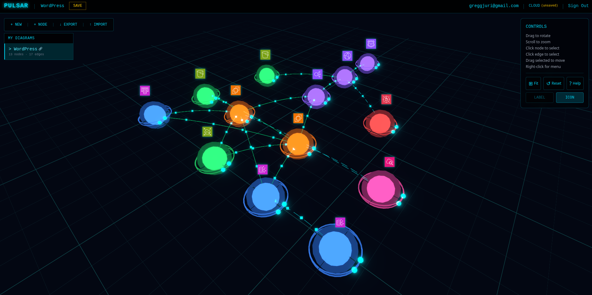

# Pulsar ✨

A 3D AWS architecture visualization tool with a sci-fi holographic aesthetic.

**Live:** [pulsar.jurigregg.com](https://pulsar.jurigregg.com)



## What is Pulsar?

Pulsar transforms boring cloud architecture diagrams into interactive, visually stunning 3D visualizations. Think Minority Report meets AWS documentation.

- 🎮 **Interactive 3D Canvas** — Rotate, zoom, and explore your architecture
- ✨ **Sci-Fi Aesthetic** — Glowing nodes, particle effects, bloom post-processing
- ☁️ **Cloud Sync** — Save diagrams to AWS, access from anywhere
- 🔗 **Public Sharing** — Share read-only links with anyone
- 🏷️ **AWS Service Icons** — Official icons for 24+ AWS services

## Features

### Visualization
- 3D node rendering with glow effects and orbital rings
- Animated particle data flows along edges
- Bloom post-processing for that holographic look
- AWS service icons displayed above nodes
- Color-coded by AWS category (compute, storage, database, etc.)

### Editing
- Add/delete nodes and edges
- Drag nodes to reposition
- Edit labels and colors
- Right-click context menu for connections
- Keyboard shortcuts (`?` to view all)

### Data Management
- Auto-save to localStorage (offline)
- Cloud save/load (authenticated)
- JSON export/import
- Public sharing via links

## Tech Stack

### Frontend
| Technology | Purpose |
|------------|---------|
| React 18 | UI framework |
| Three.js | 3D rendering |
| @react-three/fiber | React renderer for Three.js |
| @react-three/drei | Useful helpers |
| @react-three/postprocessing | Bloom effects |
| Zustand | State management |
| Tailwind CSS v4 | Styling |
| Vite | Build tool |

### Backend (AWS)
| Service | Purpose |
|---------|---------|
| S3 | Static hosting + diagram storage |
| CloudFront | CDN with SSL |
| Route53 | DNS |
| API Gateway | HTTP API |
| Lambda | Serverless handlers |
| DynamoDB | Diagram metadata |
| Cognito | Authentication |

## Architecture

```
┌─────────────────────────────────────────────────────────────────┐
│                         Route53                                 │
│                   pulsar.jurigregg.com                          │
└────────────────────────────┬────────────────────────────────────┘
                             │
                             ▼
┌─────────────────────────────────────────────────────────────────┐
│                       CloudFront                                │
│                      (CDN + SSL)                                │
└──────────────────┬─────────────────────┬────────────────────────┘
                   │                     │
                   ▼                     ▼
┌──────────────────────────┐   ┌──────────────────────────────────┐
│      S3 (Static)         │   │        API Gateway               │
│    React App Build       │   │    /diagrams, /public/{id}       │
└──────────────────────────┘   └───────────────┬──────────────────┘
                                               │
                                               ▼
                               ┌───────────────────────────────────┐
                               │           Lambda                  │
                               │        CRUD Handlers              │
                               └───────────────┬───────────────────┘
                                               │
                          ┌────────────────────┼────────────────────┐
                          │                    │                    │
                          ▼                    ▼                    ▼
               ┌──────────────────┐ ┌──────────────────┐ ┌──────────────────┐
               │    DynamoDB      │ │   S3 (Data)      │ │    Cognito       │
               │    Metadata      │ │ Diagram Content  │ │  Authentication  │
               └──────────────────┘ └──────────────────┘ └──────────────────┘
```

## Getting Started

### Prerequisites
- Node.js 18+
- AWS CLI configured
- AWS CDK bootstrapped in your account

### Local Development

```bash
# Clone the repo
git clone https://github.com/yourusername/pulsar.git
cd pulsar

# Install dependencies
npm install

# Start dev server
npm run dev
```

Open [http://localhost:5173](http://localhost:5173)

### Deploy to AWS

```bash
# First time: Bootstrap CDK
cd infra
npx cdk bootstrap aws://YOUR_ACCOUNT_ID/us-east-1

# Deploy everything
cd ..
./scripts/deploy.sh
```

### Create Admin User

```bash
./scripts/create-admin.sh
```

## Project Structure

```
pulsar/
├── src/
│   ├── components/
│   │   ├── canvas/        # 3D scene components
│   │   └── hud/           # 2D overlay components
│   ├── stores/            # Zustand state stores
│   ├── hooks/             # Custom React hooks
│   ├── utils/             # Helpers and utilities
│   └── config/            # Configuration
├── lambda/
│   └── api/               # Lambda function code
├── infra/
│   └── lib/               # CDK stack definition
├── scripts/               # Deployment scripts
├── INITIAL/               # Feature specifications
├── PRPs/                  # Implementation plans
└── docs/                  # Documentation
```

## Keyboard Shortcuts

| Key | Action |
|-----|--------|
| `?` | Show shortcuts panel |
| `F` | Fit camera to nodes |
| `R` / `Home` | Reset camera |
| `Delete` | Delete selected node/edge |
| `Escape` | Clear selection |
| `L` | Toggle labels |
| `I` | Toggle icons |

## Cost

Pulsar runs almost entirely on AWS Free Tier:

| Service | Monthly Cost |
|---------|--------------|
| S3 | $0.00 |
| CloudFront | $0.00 |
| Lambda | $0.00 |
| DynamoDB | $0.00 |
| API Gateway | $0.00 |
| Cognito | $0.00 |
| Route53 | ~$0.50 |
| **Total** | **~$0.50/month** |

## Development Workflow

This project uses a structured planning/implementation workflow:

1. **INITIAL specs** — Feature requirements (in `INITIAL/`)
2. **PRPs** — Detailed implementation plans (in `PRPs/`)
3. **Execution** — Step-by-step implementation

See [WORKFLOW.md](WORKFLOW.md) for details.

## Documentation

- [PLANNING.md](PLANNING.md) — Architecture overview and roadmap
- [DECISIONS.md](DECISIONS.md) — Architectural decision log
- [TASK.md](TASK.md) — Development session history
- [WORKFLOW.md](WORKFLOW.md) — Development process guide

## Acknowledgments

- [AWS Architecture Icons](https://aws.amazon.com/architecture/icons/) — Official service icons
- [React Three Fiber](https://docs.pmnd.rs/react-three-fiber) — React renderer for Three.js
- Aesthetic inspiration: Minority Report, Iron Man's JARVIS, Tron

---

Built with ☕ and Claude

